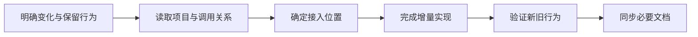

<h1 align="center">🧬 项目进化引擎skill · Project Evolution Engine</h1>

<p align="center">
  <strong>读懂现有项目，把新功能稳妥地做进下一版。</strong>
</p>

<p align="center">
  <sub>项目理解 · 改动定位 · 功能接入 · 新旧行为验证</sub>
</p>

<p align="center">
  <a href="#demo">🎬 看 Demo</a> ·
  <a href="#quick-start">🚀 快速开始</a> ·
  <a href="#workflow">🧭 工作流程</a> ·
  <a href="#capabilities">🧩 能力</a> ·
  <a href="#verification">🧪 验证</a> ·
  <a href="#structure">📁 结构</a>
</p>

<p align="center">
  
  
  <a href="https://github.com/XiaoSiKe/project-evolution-engine/actions/workflows/validate.yml"></a>
  <a href="LICENSE"></a>
</p>

---

## 🌱 为已有项目做一次完整的更新

给项目增加功能时，需要同时理解新需求、已有调用方和代码职责。项目进化引擎会先建立这些关系，再实施更新，并用实际检查验证新增能力和需要保留的旧行为。

它适合功能添加、能力扩展、流程调整，以及这些更新所需的相关修复。核心继承自[代码整理修复大师](https://github.com/XiaoSiKe/codebase-convergence)，进一步补齐了需求到实现的接入分析。

<a id="demo"></a>

## 🎬 Demo：从单条导出到批量导出

给代理这样一个任务：

> 使用 $project-evolution-engine 给已有单条导出增加批量导出，沿用现有权限和格式规则，保留旧调用，并补充测试和使用说明。

在独立评测的示例项目中，它定位到已有导出模块，复用了单条导出的规则：

```python
def export_many(records, actor):
    return [export_one(record, actor) for record in records]
```

```python
export_many(
    [
        {"id": 1, "owner": "lin", "amount": 12.5},
        {"id": 2, "owner": "lin", "amount": 3},
    ],
    actor="lin",
)
# ["1:CNY 12.50", "2:CNY 3.00"]
```

验收同时检查了输入顺序、空列表、权限拒绝、单条兼容，以及公共格式规则变化后两条路径仍然一致。这个例子来自实际运行的[行为评测](docs/verification.md)。

<a id="quick-start"></a>

## 🚀 快速开始

### 安装到 Codex

辅助脚本需要 Python 3.11+。使用已登录的 GitHub 工具或 Git 克隆仓库：

```bash
git clone https://github.com/XiaoSiKe/project-evolution-engine.git
cd project-evolution-engine

python3 scripts/install_local.py --dry-run --target ~/.codex/skills/project-evolution-engine
python3 scripts/install_local.py --install --target ~/.codex/skills/project-evolution-engine
python3 scripts/install_local.py --check --target ~/.codex/skills/project-evolution-engine
```

如果本机默认 Python 较旧，可以用 `uv run --python 3.12 python` 替代上述 `python3`。安装器支持缺失或空目标目录，也能更新未被本地改写的托管安装；遇到用户自定义文件冲突会保留现状并报告。

也可以从 [Releases](https://github.com/XiaoSiKe/project-evolution-engine/releases) 下载技能 ZIP，将其中的 `project-evolution-engine` 文件夹放入技能目录。手工安装不带托管安装记录，后续升级应保留自己的改动。

### 发起一次更新

```text
使用 $project-evolution-engine 在当前项目增加批量导出。
保持单条导出的权限、格式和调用方式，先说明接入位置，再实现并验证。
```

```text
使用 $project-evolution-engine 调整会员运费规则。
会员满 80 免运费，普通订单仍满 100；同步相关测试和文档。
```

```text
使用 $project-evolution-engine 先分析这次 API 更新的影响范围。
本次只做计划，明确需要改动的模块、需要保留的行为和验收方法。
```

<a id="workflow"></a>

## 🧭 工作流程



每项更新都要回答：**为什么改这里、复用了什么、影响哪些调用方、用什么证明完成。**

小更新只读取必要上下文；复杂更新再形成可交接的计划。已有需求足够明确时直接推进，确有业务歧义时先完成可独立处理的部分，再集中提出问题。

<a id="capabilities"></a>

## 🧩 能力与边界

| 能力 | 实际做法 |
| --- | --- |
| 🧭 理解项目 | 结合现有说明、领域决策、当前代码和测试追踪真实调用路径 |
| 📍 定位改动 | 将目标对应到具体文件、符号、职责和受影响的调用方 |
| 🧬 接入新功能 | 比较扩展现有模块、新建职责或组合实现，沿用已有规则 |
| 🛡️ 保留旧能力 | 区分有意变化与需要保留的接口、权限、格式和状态 |
| 🧪 验证结果 | 执行相关测试与检查，核对最终差异和遗留缺口 |
| 📚 更新认知 | 修正受影响的文档，只保留值得复用的新经验 |

| 可选增强 | 当前状态 |
| --- | --- |
| Serena | 内置可用性检查和符号查询路由；本次发布环境未连接，未进行真实 MCP 集成测试 |
| 代码整理修复大师 | 可按新需求与限定范围处理相关修复或审核；首发行为评测验证的是核心独立路径 |
| OpenSpec / cc-sdd / GSD 等 | 方法已适配到核心参考资料，运行时不要求安装整套框架 |

工具结果和项目图谱用于提供证据，最终接入判断仍需要结合当前代码。完成声明只覆盖实际验证过的范围。

<a id="verification"></a>

## 🧪 测试与验证

安装开发校验依赖并运行：

```bash
python3 -m pip install -r requirements-dev.txt
python3 scripts/validate_skill.py
python3 -m unittest discover -s tests -v
python3 scripts/eval_cases.py validate-cases
```

GitHub Actions 在 Python 3.11 和 3.12 上运行包、采集器、安装器及评测基础设施测试。独立代理行为评测单独记录，不与 CI 测试数量混算。

七类行为案例覆盖批量能力、授权规则变化、用户未提交修改、生成链、过期项目说明、缺少外部工具，以及业务冲突下的部分完成。评测者核对实际差异，并运行代理未读过的验收检查。

详见[验证记录与复现方法](docs/verification.md)。这些小型 Python 案例证明的是已覆盖行为，不能替代具体业务项目自身的测试。

<a id="structure"></a>

## 📁 项目结构

```text
project-evolution-engine/
├── SKILL.md                 核心入口与触发边界
├── agents/openai.yaml       中文名称与默认调用
├── references/              工作流、项目认知、接入分析、验证和来源
├── scripts/                 只读项目证据采集
├── LICENSE
└── THIRD_PARTY_NOTICES.md
scripts/                     安装、包校验、评测与发布打包
tests/                       确定性测试
evals/                       原始案例、结果约定与独立验收检查
docs/                        验证结果与复现说明
research/                    调研记录与固定来源版本
```

## 🤝 来源与致谢

在用户已有的“代码整理修复大师”基础上，参考了 OpenSpec、cc-sdd、GSD、Agent OS、Compound Engineering 和 Superpowers 的相关方法；Serena 提供可选工具接入方向。

README 的居中标题、图标导航和徽章排版参考 [Square-Q/subconscious-skill](https://github.com/Square-Q/subconscious-skill)。该参考仅涉及展示形式。

每个来源的固定提交与改写范围见[来源说明](project-evolution-engine/references/sources.md)，原始许可见[第三方声明](project-evolution-engine/THIRD_PARTY_NOTICES.md)。

---

<p align="center">🧬 让新功能进入已有项目，也让下一次修改更容易理解。</p>
